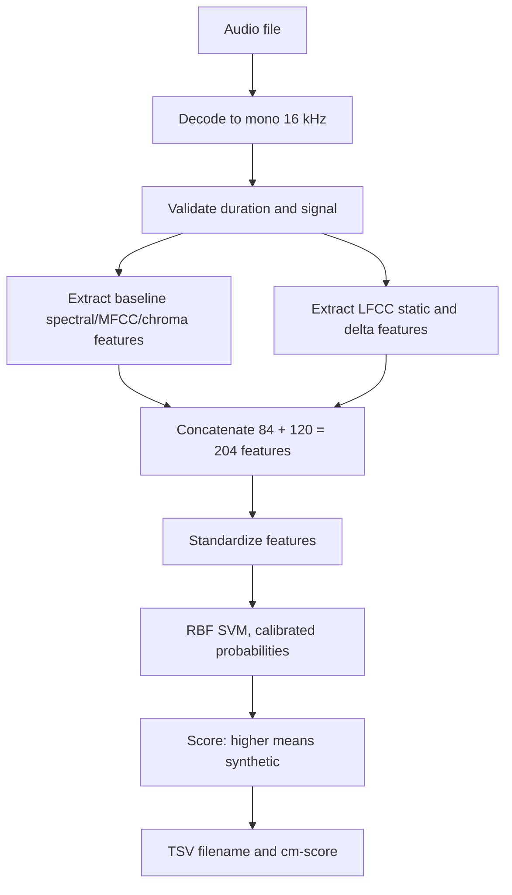

# Hearsay audio authentication

This repository contains audio classifiers for the HackGT 13 Hearsay challenge. They return a score from 0 (real) to 1 (synthetic). The current recommended scorer is `models/arshiya_librispeech_julia_lfcc.joblib`: a 75% RBF SVM / 25% logistic-regression model trained on the original 84 features plus 120 LFCC features, using LJ Speech, Mini LibriSpeech, and DiffSSD. A new training-only comparison under the corrected cost formula favors this 204-feature architecture over the 84-feature blend in all three grouped partitions. The earlier forest and baseline models remain available for comparison. Retrain the model if your data or feature code changes.

## Evaluation objective

For a population of 70% real and 30% spoof audio, a false positive means labeling real audio as synthetic, and a false negative means accepting spoof audio as real. False positives cost four times as much. The normalized cost at a score cutoff is **`(2.8 × false-positive rate + 0.3 × false-negative rate) / 0.3`**. Normalization makes an always-real decision cost 1. `minDCF` is the minimum of this cost over all possible cutoffs on labeled scores. A cutoff chosen for real use must come from development data, not the labeled evaluation set.

The corrected [LFCC comparison](models/lfcc_mindcf_comparison.json) uses three generator-held-out training partitions (1,167 clips) and an exploratory 293-clip holdout. Mean training minDCF is **0.496** for the 84-feature blend and **0.317** for the 204-feature blend; LFCC SVM-only and cost-weighted SVM alternatives scored **0.332** and **0.334**. On the holdout, the two blends score **0.130** versus **0.075** minDCF, and **0.212** versus **0.132** cost at a training-selected cutoff. These holdout clips were inspected in earlier project work, so this is supporting evidence rather than an untouched test estimate. Hidden challenge labels were not used. The report includes cache verification details; per-clip out-of-fold scores, labels, groups, and fold IDs are saved in `models/lfcc_mindcf_oof.npz`.

The separate [84-feature MindCF experiment](models/mindcf-comparison.json) improved all three training partitions but was slightly worse than the existing 84-feature blend on the exploratory holdout, so it was not promoted. `models/hearsay-lfcc-mindcf-candidate.joblib` is an opt-in full-data refit of the same architecture as the current Docker default; the default remains unchanged. Earlier LFCC, fusion, routing, and tuning reports used a formula that applied the class priors to the wrong error types. Their minDCF and selected thresholds or policies are historical and should not be compared with the corrected figures above. ROC AUC and accuracy in those reports are unaffected by that formula change.

## Approach

FFmpeg decodes the first 120 seconds of the first audio stream to mono 16 kHz audio. A fixed-size feature vector contains all signal feature families identified in `Research.md`:

| Research feature | Representation in this model |
| --- | --- |
| STFT | Short-time spectrum, spectral flux, relative low/mid/high frequency energy; the spectral statistics below also derive from STFT |
| MFCC | Mean and standard deviation of 20 coefficients |
| Chroma | Mean and standard deviation of 12 pitch classes |
| Zero-crossing rate | Mean and standard deviation |
| RMS energy | Mean and standard deviation after peak normalization |
| Spectral centroid | Mean and standard deviation |
| Spectral bandwidth | Mean and standard deviation |
| Spectral rolloff | Mean and standard deviation, at 85% cumulative energy |
| Spectral flatness | Mean and standard deviation |

The current LFCC candidate adds static, delta, and delta-delta linear-frequency cepstral statistics to the 84 baseline features. The voice-cloning, speaker-embedding, CNN, RNN, and LSTM sections of `Research.md` describe background and alternative models. They are not implemented in the saved classifiers. Compression forensics, acoustic environment, splice, and neural anti-spoofing approaches are further extensions, not detectors claimed by this version.

Before decoding, the metadata check inspects the file's container signature and, for WAV, declared chunk sizes and audio parameters. FLAC and MP3 headers are also checked. When the inspected metadata is coherent, the final synthetic score is multiplied by **0.95**, giving a small additional weight to “real.” Inconsistent or unrecognized metadata leaves the audio score unchanged. The score explanation shows both the audio score and this adjustment. A clean header can be forged and is common in synthetic audio, so this is a weak heuristic rather than proof of authenticity.

The optimized baseline standardizes all 84 features before fitting an RBF SVM and logistic regression. Their synthetic scores are averaged with weights 0.75 and 0.25. The recommended LFCC candidate uses the same model on all 204 features. Score explanations do not claim additive feature explanations. The original model averages two 300-tree forests, one using all 84 features and the other using 20 spectral and statistical features. Only the forest model provides tree-path feature contributions. These describe model behavior, not proof that a clip was generated.

## Install

Use Python 3.12, matching the model and Docker image:

```sh
python -m venv .venv
# Activate the virtual environment using your shell's usual command.
python -m pip install -r requirements.txt
```

`imageio-ffmpeg` supplies an FFmpeg executable. WAV, MP3, M4A, MP4 audio, OGG, FLAC and other formats supported by that executable can be decoded. Encrypted, corrupt, silent, or unsupported files produce a clear error.

The provided `HackGTHearsayTesting.zip` contains a TAR archive with 1,671 test WAV files and a tab-delimited score template. Prepare it with:

```sh
python scripts/prepare_test_data.py --archive "/path/to/HackGTHearsayTesting.zip" --output data
```

This creates `data/test` and `data/HGT_Hearsay_score_template.csv`. The template's repeated `0.006` scores are placeholders, not labels. The test archive cannot be used to train or evaluate the classifier.

## Train

The supplied training archives are `LJRealResampled.zip` (real) and `DiffSSD.zip` (synthetic). Both contain nested TAR files. Prepare a reproducible sample and manifest with:

```sh
python scripts/prepare_training_data.py --real-archive "/path/to/LJRealResampled.zip" --synthetic-archive "/path/to/DiffSSD.zip" --output data
```

The script uses all 242 LJ real clips and up to twice as many synthetic clips, sampled deterministically across ten DiffSSD generator families. The ZIPs remain untouched. It retains additional synthetic candidates on disk for the later LibriSpeech rebalancing step; only selected clips appear in `data/train.csv`. The `group` column keeps LJ chapters and synthetic generator families whole in validation. LJ chapters still share one speaker, so this grouping alone does not test an unseen real voice. The first model marked a spot check of challenge files almost uniformly synthetic.

The expanded models use a deterministic selection of real clips from 26 speakers in [OpenSLR Mini LibriSpeech SLR31](https://openslr.org/31/) (`dev-clean-2.tar.gz`, CC BY 4.0). Download that archive from the official page, verify its MD5 is `6d7ab67ac6a1d2c993d050e16d61080d`, then run:

```sh
python scripts/add_librispeech_real.py --archive data/external/dev-clean-2.tar.gz --data data
```

This updates `data/train.csv` with 242 LJ real clips, 488 LibriSpeech real clips, and 730 DiffSSD synthetic clips balanced across the ten generators. Before replacing the original manifest, the script saves it once as `data/train_pre_librispeech.csv` for paired evaluation. The `group` column identifies LibriSpeech speakers, LJ chapters, and synthetic generators so related clips stay together in a split. The included training summary is in `data/train_summary.json` after preparation.

The preparation scripts accept either the original raw `.tar` files or the ZIP-wrapped TAR archives. The challenge test archive is only for generating predictions; do not use its score key or hidden labels for training, route selection, or evaluation.

Prepare a UTF-8 CSV (or `.tsv`) with `filename,label` columns. Audio paths are relative to the manifest. Accepted labels are `real`, `bonafide`, or `0` and `synthetic`, `spoof`, or `1`. An optional `group` column should identify a speaker, source recording, or generator family shared by clips. The validation split keeps entire groups together when provided. Example:

```csv
filename,label,group
audio/real_001.wav,real,speaker_01
audio/fake_001.mp3,synthetic,generator_a
```

Use `hearsay/utils.py` to create reproducible labeled training and test manifests. The CSVs point to the original audio files, so the clips are not copied:

```sh
python -m hearsay.utils --manifest data/train.csv --output data/split --seed 42
python -m hearsay train --manifest data/split/train.csv --test-manifest data/split/test.csv --model models/hearsay-split.joblib --report models/split-validation.json --feature-cache data/split/split_features.npz
python -m scripts.train_optimized
```

The `hearsay train` command reproduces the forest baseline. `scripts.train_optimized` uses only the 1,167 training clips for model selection, holding out each synthetic generator in turn alongside disjoint real groups. It then fits the selected blend on all training clips and evaluates it once on the 293 test clips. The script saves `models/hearsay-optimized.joblib` and `models/optimized-comparison.json`. `utils.py` keeps entire groups together when the manifest has a `group` column; without it, the split is stratified by label at the clip level and can overestimate performance when speakers or generators overlap. You can also pass the original `data/train.csv` directly to `hearsay train`; it uses the same split internally. On datasets too small for a two-class holdout, it fits all rows and reports that validation was unavailable. The optional feature cache avoids decoding unchanged audio on repeat fits. Model files are Python joblib pickles; load only ones you trust. The 0–1 values are classifier scores, not independently calibrated probabilities.

`data/split/test.csv` is a labeled holdout for checking the model. The separate `data/test` directory from `HackGTHearsayTesting.zip` has no labels and is used only for predictions.

### What validation found

The supplied training set is difficult to validate across unseen generators. The original `models/hearsay.joblib` and its saved reports predate the split utility: its one group holdout (Grad-TTS plus unseen real groups) yielded ROC AUC **0.567** and balanced accuracy **0.489** at 0.5. A separate leave-one-generator-family-out check across all ten families, using one fixed real-speaker split, averaged ROC AUC **0.914** with a worst family of **0.715**. On five different real-speaker splits for Grad-TTS alone, its mean AUC was **0.695** and its lowest was **0.571**. Results depend strongly on which real speakers are held out. See `models/validation.json`, `models/ensemble_holdout.json`, and `models/grad_holdout.json` for the exact splits and scores. Retraining with the commands above writes a new model and report.

On the current group-disjoint split (1,167 training and 293 test clips), Julia's saved optimized model improved these original-run accuracy metrics:

| Evaluation | Forest baseline | Optimized blend |
| --- | ---: | ---: |
| Training-only generator-held-out validation accuracy | 0.7464 | 0.8509 |
| Held-out test accuracy | 0.8874 | 0.9454 |
| Held-out test ROC AUC | 0.9482 | 0.9930 |

The minDCF values in `models/optimized-comparison.json` used an older ASVspoof formula, while the later Arshiya reports applied the 70/30 priors to the wrong error types. `scripts/train_optimized.py` and `hearsay/routing.py` now implement the objective above. Use `models/mindcf-comparison.json` for the corrected 84-feature comparison and `models/lfcc_mindcf_comparison.json` for the corrected LFCC comparison.

The original and optimized models have 0.8703 and 0.9454 audio-only held-out accuracy, respectively; the optimized model's accuracy gain does not depend on metadata adjustment. The held-out synthetic groups are only PlayHT and Pro Diff. PlayHT uses `.wav` names with MP3 headers, a source-specific mismatch that may not recur with other generators or transcoded files. Some synthetic speaker IDs recur across generator families, and LJ chapters share a narrator.

No independent labeled Hearsay test results are available.

## Score one clip

```sh
python -m hearsay score --model models/hearsay-optimized.joblib --audio data/sample.m4a
```

The JSON includes the final `cm-score`, audio-only `audio_score`, both component scores, and the metadata adjustment. The original forest additionally reports tree-path feature contributions.

## Create the required prediction TSV

```sh
python -m hearsay predict-lfcc --model models/arshiya_librispeech_julia_lfcc.joblib --input data/test --template data/HGT_Hearsay_score_template.csv --output predictions/hearsay_predictions.tsv
```

The original 84-feature model remains available with `python -m hearsay predict --model models/hearsay-optimized.joblib ...`; that command also accepts `--explanations`. These challenge clips are never part of the labeled train/test split or accuracy calculation. The TSV has the required `filename` and `cm-score` columns. Files are discovered recursively in the test directory; basenames must be unique. `--template` verifies that every expected file is present exactly once and preserves the template row order. If any file cannot be decoded, the command fails rather than silently omitting it.

## Docker

In PowerShell, with Docker Desktop running, run:

```powershell
docker build -t hearsay .
docker run --rm -v "${PWD}/data:/data:ro" -v "${PWD}/predictions:/predictions" hearsay predict-lfcc --model /app/models/arshiya_librispeech_julia_lfcc.joblib --input /data/test --template /data/HGT_Hearsay_score_template.csv --output /predictions/hearsay_predictions.tsv
```

The image includes the current LFCC candidate, the Julia baseline, the forest baseline, and prior LFCC candidates. The command scores `/data/test`, checks filenames against the provided template, and writes the TSV in template order. For routed inference, build and pass a router artifact explicitly; Qiskit itself is not needed by the scoring container.

## Conditional fusion (Arshiya branch)

`hearsay/forensics.py` extracts lightweight recording-condition and optional metadata indicators. Missing metadata is neutral. These indicators describe file/recording conditions; they are not direct real/synthetic decisions. `hearsay/routing.py` supports a global blend and a K-means condition router. For both components, larger scores must mean “more synthetic.”

The evaluator now uses the normalized cost formula in **Evaluation objective**. It expects out-of-fold score rows with `filename,label,group,arshiya_score,julia_score` columns. Component scores must come from models that did not train on the corresponding clip. Existing saved router policies were selected under the earlier formula; rerun their evaluation before use. Example:

```sh
python scripts/generate_oof_scores.py --manifest data/train.csv \
  --output data/arshiya_oof.tsv
# Have Julia produce scores for those exact filenames and the same group-held-out folds.
# Merge the score columns into data/oof_scores.tsv, retaining label and group.
python scripts/evaluate_routing.py --scores data/oof_scores.tsv \
  --output models/router.joblib --report models/routing_validation.json
```

The report compares global weighted fusion with per-quality-cluster blend weights using a second group holdout. Small or one-class clusters fall back to the global blend. Fit the final router from grouped out-of-fold component scores, and retain the split results in project documentation.

At inference, Julia can provide a TSV/CSV with `filename,julia-score`. If the score file is supplied, `predict-routed` uses the saved cluster router, or a 50/50 blend without a router. If no Julia score file is supplied, it safely falls back to the bundled Arshiya model:

```sh
python -m hearsay predict-routed --model models/hearsay-optimized.joblib \
  --router models/router.joblib --julia-scores data/julia_predictions.tsv \
  --input data/test --template data/HGT_Hearsay_score_template.csv \
  --output predictions/Arshiya_predictions.tsv
```

The optional Qiskit experiment uses a quantum fidelity kernel plus spectral clustering on a bounded subset of quality vectors. `evaluate_routing.py --clusterer qiskit` evaluates that route on grouped holdouts and saves a router artifact with a nearest-centroid inference approximation, so the standard Docker scorer does not need Qiskit. Qiskit is an optional research dependency and is not included in the required image:

```sh
python -m pip install -r requirements-quantum.txt
python scripts/evaluate_routing.py --scores data/oof_scores.tsv \
  --clusterer qiskit --output models/quantum_router.joblib \
  --report models/quantum_routing_validation.json
```

The standalone `scripts/quantum_cluster.py` also reports agreement with ordinary K-means using ARI/NMI. Cluster agreement alone does not establish better detection; compare quantum-derived routing against the global blend using the grouped out-of-fold minDCF report before selecting it.

## Arshiya experimental feature views

`hearsay/temporal.py` keeps coarse time order in eight audio windows and measures how energy, spectral shape, and frame-level activity change. `hearsay/encoding.py` records WAV format facts where available plus decoded-signal clues such as quantization levels and spectral cutoff. Neither module modifies or denoises audio. Their separate ExtraTrees candidates are experimental and do not change the standard submission CLI.

Run the grouped comparison and paired lossy-re-encoding probe with:

```sh
python scripts/evaluate_feature_views.py --manifest data/train.csv --cache data/train_features.npz
```

The report compares baseline, temporal, encoding header facts, signal-level encoding traces, and fixed equal-weight blends using five-fold `StratifiedGroupKFold`. Its saved minDCF values predate the formula correction and need rerunning before model selection. The MP3 probe is an in-sample stability check only; it is not an accuracy result. The current DiffSSD/LJ source mix has a pronounced provenance cue (real WAVs are 16 kHz, while synthetic WAVs have a 22.05 kHz median source rate). Therefore the header-only and signal-level encoding models are diagnostics and should not vote on authenticity. The signal-only candidate excludes header fields, but it still shows source/bandwidth bias and substantial score movement after MP3 conversion. Generated candidate artifacts are `models/arshiya_temporal_candidate.joblib` and `models/arshiya_encoding_candidate.joblib`.

Historical results are in `models/arshiya_feature_views_validation.json`. The signal-only encoding expert's score rank correlation after lossy MP3 conversion was only 0.79, and it likely exploits recording bandwidth/source differences. Keep temporal as a candidate for further independent validation; do not include encoding scores in the submission blend without source-matched external validation.

## LFCC spectral evidence (single model, no score blending)

`hearsay/lfcc.py` extracts linear-frequency cepstral coefficients with static, delta, and delta-delta statistics. The experimental candidate concatenates these 120 LFCC values with the existing 84 acoustic features and trains one ExtraTrees model. A second candidate applies a fixed 7 kHz low-pass filter to every clip before extracting the same features; this tests whether restricting bandwidth reduces codec/source-rate shortcuts. This is a deterministic preprocessing step, not an attempt to denoise or reconstruct the original recording. Neither candidate changes the default `predict` scorer.

Evaluate both candidates with grouped speaker/generator folds and the challenge operating assumptions:

```sh
python scripts/evaluate_lfcc.py --manifest data/train.csv
```

The older `models/arshiya_lfcc_validation.json` needs a minDCF rerun under the corrected formula. The opt-in low-pass candidate can be scored with:

```sh
python -m hearsay predict-lfcc --model models/arshiya_lfcc_lowpass.joblib \
  --input data/test --output predictions/Arshiya_lfcc_predictions.tsv
```

If the challenge filename-order template is available, pass it with `--template /path/to/template.tsv` so output rows follow its order exactly.

The old grouped cross-validation covers 726 LJ/DiffSSD clips. Its in-sample 64 kbps MP3 probe shows lower mean score movement for the common-band version (0.137 vs 0.278) and higher rank correlation (0.914 vs 0.802), but is only a stability diagnostic. Source and bandwidth mismatch remain risks. Compare the low-pass candidate under the corrected objective before replacing the recommended model.

## Julia model with Arshiya LFCC inputs

The merged evaluator tests Julia's 75/25 RBF-SVM/logistic model both on its original 84 features and on concatenated 84 baseline + 120 LFCC features. It also compares a fixed 7 kHz common-band version and single ExtraTrees candidates. Its saved five-fold results used the earlier cost formula; rerunning the script now uses the corrected formula. This changes the model's input evidence rather than blending Julia and Arshiya output scores.

```sh
python scripts/evaluate_julia_lfcc.py --manifest data/train.csv
```

The historical results and artifacts are in `models/arshiya_julia_lfcc_validation.json`. Its minDCF rankings were calculated with the reversed-prior formula and are superseded by the corrected comparison at the top of this README. The cost-weighted ExtraTrees code now applies the 70/30 priors to the correct classes, but its saved model was trained with the old weights and needs retraining before use.

Julia's saved optimized model was checked against locally available rows in the group list recorded in its report. The historical `models/arshiya_merged_holdout_validation.json` predates the Mini LibriSpeech retrieval and covers only 149 clips; it must not be treated as the full 293-clip holdout. The expanded-data grouped validation below is the current comparison.

Score the opt-in common-band candidate in challenge template order with:

```sh
python -m hearsay predict-lfcc \
  --model models/arshiya_lfcc_lowpass_candidate.joblib \
  --input data/test --template data/HGT_Hearsay_score_template.csv \
  --output predictions/Arshiya_lfcc_candidate.tsv
```

The Docker default now selects the expanded-data LFCC candidate; the Julia baseline remains available for direct comparison. Hidden test labels were not used.

## External-source expansion and nested SVM check

The recommended candidate uses real speech from OpenSLR Mini LibriSpeech SLR31 (`dev-clean-2`, CC BY 4.0) in addition to the supplied LJ Speech and DiffSSD data. Download the official 126 MB archive from [OpenSLR](https://openslr.org/31/), verify MD5 `6d7ab67ac6a1d2c993d050e16d61080d`, and build the expanded manifest:

```sh
mkdir -p data/external
curl -fL https://openslr.trmal.net/resources/31/dev-clean-2.tar.gz -o data/external/dev-clean-2.tar.gz
md5 data/external/dev-clean-2.tar.gz
python scripts/add_librispeech_real.py --archive data/external/dev-clean-2.tar.gz --data data
```

The preparation selects up to 20 clips per speaker, keeps all 26 speaker IDs as separate groups, and balances 730 real clips (242 LJ + 488 LibriSpeech) with 730 DiffSSD clips across ten generator families. The audio archive, extracted audio, manifests, and feature caches are ignored by Git. Reproduce the LFCC model comparisons and paired corpus ablation with:

```sh
python scripts/evaluate_julia_lfcc.py --manifest data/train.csv \
  --feature-cache data/librispeech_features.npz \
  --report models/arshiya_librispeech_julia_lfcc_validation.json \
  --raw-model models/arshiya_librispeech_julia_lfcc.joblib \
  --lowpass-model data/research_julia_lfcc_lowpass.joblib \
  --extra-trees-model data/research_extra_trees_lowpass_lfcc.joblib \
  --cost-weighted-model data/research_costweighted.joblib
python scripts/evaluate_librispeech_expansion.py --manifest data/train.csv \
  --base-manifest data/train_pre_librispeech.csv \
  --report models/arshiya_librispeech_expansion_comparison.json
```

The historical expanded-corpus reports predate the formula correction. Their minDCF and model selections need fresh grouped evaluation before comparison. The new `scripts/evaluate_lfcc_mindcf.py` evaluates the 84-feature blend, the 204-feature blend, an LFCC SVM, and a cost-weighted LFCC SVM on three training-only partitions, then checks the chosen architecture on the labeled holdout. Reproduce the corrected comparison with:

```sh
python -m scripts.evaluate_lfcc_mindcf
```

For a cache created before the latest feature-code fingerprint, `--reuse-existing-baseline-cache` explicitly checks source ages and five decoded rows and records that weaker verification in the report. The LFCC cache resumes from saved partial progress if extraction is interrupted. The older nested SVM C-search can be rerun under the corrected evaluator with:

```sh
python scripts/evaluate_lfcc_svm_tuning.py --manifest data/train.csv \
  --feature-cache data/librispeech_features.npz \
  --report models/arshiya_librispeech_lfcc_svm_tuning.json \
  --model data/research_librispeech_lfcc_svm_tuned.joblib
```

Older report files retain their historical metric values; no Hearsay test labels or score key were used.

These external-source checks improve coverage of real-speaker variation, but the synthetic side remains DiffSSD. They are not a substitute for evaluation on a separate corpus containing both bona fide and spoof speech, such as the larger ASVspoof 5 corpus referenced by the challenge organizers.

## Unseen-generator benchmark (ASVspoof 5)

`scripts/prepare_asvspoof5.py` builds manifests from official Track 1 protocols and locally extracted FLAC shards. It groups bona fide audio by speaker and spoof audio by attack family, so neither group is split across training folds. The benchmark runner combines the Hearsay training set with balanced samples from ASVspoof 5 `T_aa`, selects models only from five grouped out-of-fold predictions, and evaluates once on the separate `D_aa` development shard. The latter contains attack families absent from `T_aa`. Its report compares the 84-feature ExtraTrees model, 204-feature logistic regression and RBF SVM with balanced and false-alarm-cost class weights, an ordered temporal-feature model, and a cross-fitted K-means condition router. The ASVspoof development partition is never used for model fitting, score-weight selection, or threshold selection.

The official audio and protocol archives are available from the [ASVspoof 5 dataset record](https://zenodo.org/records/14498691). The audio is large. Keep downloaded and extracted files under `data/external/asvspoof5` (ignored by Git), and follow the source dataset's ODC-By terms. After obtaining `flac_T_aa.tar` and `flac_D_aa.tar`, prepare and run the benchmark as follows:

Published ASVspoof challenge systems pair pretrained Wav2Vec2/WavLM representations with anti-spoof classifiers, then test channel, room, time-mask, and codec augmentations. A separate temporal/multi-view study also reports a large gap between its progress-set and full-evaluation results. That supports this branch's unseen-family holdout and argues against selecting a model from a single convenient split. The current scorer stays with the repository's CPU-friendly scikit-learn stack; pretrained SSL inference would add a large model and PyTorch dependency to the Docker image. See the [ASVspoof 5 system description](https://arxiv.org/abs/2408.09933) and [temporal multi-view study](https://arxiv.org/abs/2408.06922).

```sh
mkdir -p data/external/asvspoof5/audio/train data/external/asvspoof5/audio/dev
tar -xf data/external/asvspoof5/flac_T_aa.tar -C data/external/asvspoof5/audio/train
tar -xf data/external/asvspoof5/flac_D_aa.tar -C data/external/asvspoof5/audio/dev
python scripts/prepare_asvspoof5.py --partition train \
  --audio-root data/external/asvspoof5/audio/train \
  --output data/external/asvspoof5/manifests/train.tsv
python scripts/prepare_asvspoof5.py --partition dev \
  --audio-root data/external/asvspoof5/audio/dev \
  --output data/external/asvspoof5/manifests/dev.tsv
python scripts/evaluate_asvspoof5.py --workers 6
```

Feature extraction is cached and resumes after interruption. The run also saves `models/asvspoof5_lfcc_candidate.joblib`, selected only from grouped training OOF scores and accepted by the existing `predict-lfcc` command; the report compares that candidate against the unchanged Hearsay model on the unseen-attack shard. Review those results before replacing the default model. A monotonic score remapping cannot change minDCF or EER because both metrics sweep the threshold; improving either requires changing which real and spoof clips the model ranks above one another. Lowering probabilities can still affect a fixed deployment threshold, but it is a calibration/operating-point change, not a ranking improvement.

### Scoring flow



The benchmark also computes an ordered temporal feature view (eight time bins of energy, zero-crossing rate, spectral centroid, flatness, flux, and band energy). It is an evaluated candidate, not automatically blended into the final score. Likewise, the quality-feature K-means router clusters recording conditions and learns a blend between the baseline model and Julia's score only from training OOF predictions. This is a conditional *model-weight* rule, not an if/else detector for “real” or “synthetic.” Keep it only if it improves held-out folds and the separate dev check.

### What each method contributes

- **Baseline spectral features:** Summaries of spectral shape, MFCCs, chroma, energy, and frame-to-frame changes. This is compact and runs on CPU, but averaging over a whole clip loses some time order.
- **LFCC:** Uses evenly spaced frequency filters, preserving fine detail across frequency. Static coefficients describe timbre; first and second deltas describe how the spectrum changes. Mean and standard deviation create a fixed-size 120-value representation.
- **RBF SVM:** A nonlinear margin classifier over standardized baseline+LFCC features. Sigmoid calibration maps its decision values to scores usable as spoof probabilities; scores are still ranking evidence, not guaranteed calibrated real-world probabilities.
- **Cost-sensitive training:** Sets the real-class sample weight using the challenge's 4x false-alarm cost and 30% spoof prior. The evaluation metric also includes those costs. This training weight is a candidate design choice, not a guarantee of fewer false alarms; FAR must be measured at a stated threshold.
- **C sweep:** The benchmark compares RBF-SVM regularization strengths `C=0.3, 1, 3`, with both balanced and cost-sensitive class weights. The weakest setting underfits in this experiment; `C=3` had the lowest combined grouped-OOF minDCF by a very small margin. It is compared against the unseen dev set before describing it as a practical improvement.
- **Temporal model:** Tests speech dynamics directly. On the current benchmark it is weak by itself, so it should not be granted a blend weight without new evidence.
- **K-means routing:** Unsupervised clusters over recording-quality descriptors (duration, clipping, activity, flatness, band fractions, flux, metadata/encoder tags). A cluster-specific blend is learned only where training examples are sufficient. It is a small hypothesis to test, not a primary detector.
- **minDCF:** For a threshold `t`, clips scoring at or above `t` are called spoof. With `Pspoof=.3`, `Cmiss=1`, and `Cfa=4`, normalized cost is `FNR + 9.333 × FPR`. `minDCF` sweeps all thresholds, so a uniform score shrink cannot improve it; the model must improve the ordering of real versus synthetic scores.

### Latest measured run

The saved report used 11,261 combined training clips (1,460 Hearsay plus 9,801 ASVspoof 5) and a balanced 2,000-clip dev sample (1,000 per class) covering all eight unseen attack families A09–A16. Five grouped folds held out complete real-speaker and spoof-family groups. The best selected C-sweep candidate had grouped-OOF minDCF `0.2190` and EER `7.74%`; on sampled unseen dev it had minDCF `0.3637`, EER `12.9%`, and AUC `0.9199`. The unchanged Hearsay model had dev minDCF `0.7110`, EER `22.6%`, and AUC `0.8629`. At the candidate's OOF-selected threshold, sampled dev FAR was `0.7%` and miss rate `31.8%`.

This is evidence of improved separation on the sampled external corpus, not a measured Hearsay hidden-test improvement. Earlier cost-sensitive `C=1` had slightly better dev minDCF (`0.3563`) while the new `C=3` candidate won combined OOF by only `0.0002`; that difference is small enough to be validation noise. K-means routing improved sampled dev minDCF only from `0.3677` to `0.3647`, and helped only one of five grouped OOF folds, so it is not a robust improvement. One bona fide dev clip was shorter than the pipeline's 0.5-second minimum and was excluded. Do not use these dev labels to tune thresholds or claim challenge-score gains.

## Nested fusion experiment

To assess Arshiya+Julia fusion without changing the default scorer, run:

```sh
python scripts/evaluate_fusion.py --manifest data/train.csv
```

This compares the acoustic baseline, Julia-style 5% metadata adjustment, temporal expert, fixed 50/50 fusion, and inner-fold-tuned weights using nested speaker/generator-grouped folds. It writes separate candidate artifacts (`models/arshiya_fusion_baseline.joblib`, `models/arshiya_fusion_temporal.joblib`, `models/arshiya_fusion_policy.json`) and a validation report. The fused predictor is opt-in:

```sh
python -m hearsay predict-fused \
  --model models/arshiya_fusion_baseline.joblib \
  --temporal-model models/arshiya_fusion_temporal.joblib \
  --policy models/arshiya_fusion_policy.json \
  --input data/test --template data/HGT_Hearsay_score_template.csv \
  --output predictions/Arshiya_fused_predictions.tsv
```

The saved fusion policy was selected under the earlier metric and needs a corrected grouped evaluation before use. LJ/DiffSSD source conditions also differ from the challenge distribution. Hidden test labels are not used.

Run the software smoke test with `python -m unittest discover -s tests -v`. Its generated tones only verify the pipeline; they do not estimate deepfake detection performance.

## Limits

The detector needs labeled, varied training data. The added LibriSpeech voices reduce the original one-speaker bias, but the real data still consists of audiobook recordings while the synthetic data comes from DiffSSD. Studio, phone, outdoor, noisy, replayed, and partially edited clips remain underrepresented. Evaluate on speakers, generators, and recording conditions that training did not include. A low score is not authentication; replay, partial edits, and unseen voice generators may evade either classifier. The first 120 seconds are analyzed, so later edits in longer recordings are not covered.
