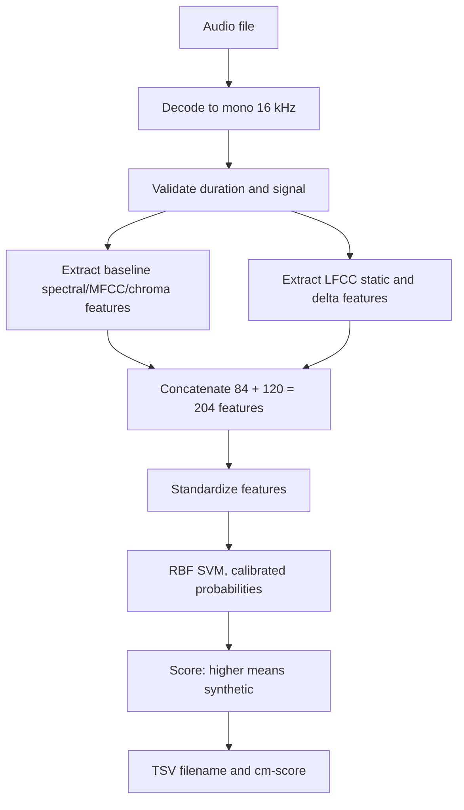

# Hearsay: Audio Deepfake Detection & Forensics

**Hearsay** is an audio authentication system built for the HackGT 13 Hearsay challenge. It scores audio files on a scale from **0 (Real)** to **1 (Synthetic)**.

Rather than relying on a single black-box model, Hearsay combines file metadata checks, frequency-domain spectral analysis, and temporal speech dynamics. It then uses an intelligent condition router to score audio efficiently without brute-forcing heavy computations.

## Forensic Diversity & Detector Architecture

To maximize detection breadth, Hearsay analyzes audio across multiple distinct forensic layers:

### 1. Container & Digital File Forensics (Metadata)

* **What it does:** Inspects digital container signatures, declared WAV chunk sizes, and FLAC/MP3 headers before decoding the audio. If the structural metadata is valid and consistent, the final synthetic score receives a conservative 0.95x multiplier toward "real". If headers are corrupted or spoofed, no bonus is granted.

### 2. Spectral & Frequency-Domain Analysis

* **What it does:** Decodes audio to 16 kHz mono and extracts a 204-feature vector using Short-Time Fourier Transform (STFT) statistics, 20 Mel-Frequency Cepstral Coefficients (MFCCs), spectral centroid, bandwidth, flatness, flux, and 120 Linear-Frequency Cepstral Coefficients (LFCCs including static, delta, and delta-delta features). This scans for any subtle, unnatural mathematical artifacts left in spectral frequencies by an AI voice generator.

### 3. Prosody & Speech Dynamics

* **What it does:** Measures Chroma (12 pitch classes), Root Mean Square (RMS) energy, Zero-Crossing Rate (ZCR), and tracks energy shifts across 8 time-ordered audio windows. We use this to evaluate the cadence and rhythm of speech and check whether volume, pitch, and speech pauses flow naturally.

### 4. Machine Learning Classification

* **Core Model:** A hybrid **75% Radial Basis Function (RBF) SVM + 25% Logistic Regression** classifier trained on 204 features across LJ Speech, Mini LibriSpeech, and DiffSSD datasets.
  
## Smart Routing & System Explainability

### Agentic Orchestration (Condition-Based Routing)

Instead of brute-forcing every audio file through identical heavy pipelines, Hearsay uses an **unsupervised K-means condition router**.

* **How it works:** It inspects signal-level recording quality indicators (clipping, duration, spectral activity, flatness, and encoder tags).

* **Why it matters:** The system dynamically categorizes the recording condition and applies cluster-specific model blending weights, ensuring noisy or truncated clips are evaluated using rules optimized for those conditions.

### Explainable AI & Scoring Transparency

Hearsay avoids black-box decisions by returning detailed JSON explanations for every scored clip:

* **Score Breakdown:** Output files separate the final decision score into the raw `audio_score`, component model scores, and metadata adjustments.

* **Feature Contributions:** When using the decision tree models, the system outputs tree-path feature contributions, detailing exactly which acoustic variables pushed a clip toward synthetic or real.
  
### Scoring Flow

When an audio clip enters the pipeline, FFmpeg first decodes it into a standardized 16 kHz mono audio stream and verifies its duration and signal integrity. Next, two parallel feature extractors pull 84 baseline acoustic traits (like spectral shape, MFCCs, and chroma) alongside 120 static and delta LFCC traits. These are concatenated into a single 204-feature vector, standardized, and fed into an RBF SVM to compute a calibrated synthetic probability score (where higher means more likely synthetic). Finally, the system factors in any metadata checks before exporting the filename and final decision score into the submission TSV.



## Installation & Usage

### Prerequisites & Setup

Requires **Python 3.12**:

```sh
# Clone repo & set up virtual environment
python -m venv .venv
source .venv/bin/activate  # On Windows: .venv\Scripts\activate

# Install dependencies
python -m pip install -r requirements.txt

```

### 1. Score a Single Audio Clip

Inspect a single clip and get a full JSON breakdown:

```sh
python -m hearsay score --model models/hearsay-optimized.joblib --audio path/to/sample.m4a

```

### 2. Generate Challenge Predictions

Batch-score a test directory using the recommended LFCC model:

```sh
python -m hearsay predict-lfcc \
  --model models/arshiya_librispeech_julia_lfcc.joblib \
  --input data/test \
  --template data/HGT_Hearsay_score_template.csv \
  --output predictions/hearsay_predictions.tsv

```

### 3. Run via Docker

```powershell
docker build -t hearsay .
docker run --rm -v "${PWD}/data:/data:ro" -v "${PWD}/predictions:/predictions" hearsay predict-lfcc `
  --model /app/models/arshiya_librispeech_julia_lfcc.joblib `
  --input /data/test `
  --template /data/HGT_Hearsay_score_template.csv `
  --output /predictions/hearsay_predictions.tsv
```[cite: 1]

### 4. Model Retraining & Validation
* **Prepare Data:** Run `python scripts/prepare_training_data.py` and `python scripts/add_librispeech_real.py` to rebuild training manifests[cite: 1].
* **Evaluate Routing & Models:** Rerun cross-validation benchmarks via `python -m scripts.evaluate_lfcc_mindcf`[cite: 1].

```
